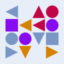
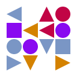
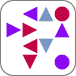
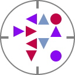

# hh - Humanized Hash (C++)

hh turns a blockchain address, a public key or any hash into a small deterministic picture that a
person can compare at a glance: a 4 x 4 matrix of solid squares, circles and triangles in four
colours. It exists to catch address poisoning and clipboard substitution, which work because
people check only the first and last characters of a long string. The colours are chosen so that
people with a colour vision deficiency can tell them apart as well.

| `0x1234567890abcdef00112233445566778899aabb` | `0x12345678f1e2d3c4b5a69788796a5b4c8899aabb` |
|---|---|
|  |  |

The two addresses agree in their first and last eight hex digits. Their pictures are unrelated.

This repository is the C++17 reference implementation. It owns the specification
([docs/SPEC.md](docs/SPEC.md)) and the golden vectors (`testdata/`) that every implementation
reproduces.

## Implementations

Every implementation produces the same pictures, tags and encoded files, byte for byte, and its
tests check it against a copy of the golden vectors of hh-cpp.

| Language | Repository | Package | Install |
|---|---|---|---|
| C++17, C ABI | hh-cpp (this repository), the reference: specification and golden vectors | CMake `hh::hh`, pkg-config `hh` ([releases](https://github.com/censync/hh-cpp/releases)) | CMake `FetchContent` or `find_package(hh)` |
| Kotlin and Java: JVM, Android | [hh-kotlin](https://github.com/censync/hh-kotlin) | Maven Central [`io.github.censync:hh`](https://central.sonatype.com/artifact/io.github.censync/hh) | `implementation("io.github.censync:hh:1.1.0")` |
| TypeScript and JavaScript: browsers, Node.js, Deno, Bun | [hh-ts](https://github.com/censync/hh-ts) | npm [`@censync/hh`](https://www.npmjs.com/package/@censync/hh) | `npm install @censync/hh` |
| Go | [go-hh](https://github.com/censync/go-hh) | [`github.com/censync/go-hh`](https://pkg.go.dev/github.com/censync/go-hh) | `go get github.com/censync/go-hh` |
| Python | [hh-python](https://github.com/censync/hh-python) | PyPI [`humanized-hash`](https://pypi.org/project/humanized-hash/) | `pip install humanized-hash` |

## A longer example: Sui

A Sui address has 64 hex digits, and nobody reads 64 digits. The second address below differs
from the first in one digit, the third in two; the changed digits are marked. In the text
they are easy to miss. The pictures and the tags are unrelated, because every cell depends on
every bit of the input.

| Picture | Address | Tag |
|---|---|---|
|  | <code>0xeab3150efcb34ff74930d8f3d491be109070a39e4d380de7737aff5c72a0b6b2</code> | `B6P-65H` |
|  | <code>0xeab3150efcb34ff74930d8f<ins><b>8</b></ins>d491be109070a39e4d380de7737aff5c72a0b6b2</code> | `Q60-QKR` |
|  | <code>0xeab3150efcb34ff74930d8f3d491be1090<ins><b>1</b></ins>0a39e4d380d<ins><b>c</b></ins>7737aff5c72a0b6b2</code> | `ZSJ-7BK` |

What a forger pays, by calculation. One current GPU tries about 1.4 billion addresses per second;
a try against hh also has to compute the stretched base digest, which leaves about 680 000 tries
per second. The figures are the expected search times on one such GPU for a typical picture
([docs/SECURITY.md](docs/SECURITY.md) has the reasoning).

| The forged address has to match | Tries | One GPU |
|---|---|---|
| the first 4 and the last 4 hex digits | 2^32 | 3 seconds |
| the first 6 and the last 6 hex digits | 2^48 | 2.3 days |
| the first 8 and the last 8 hex digits | 2^64 | 420 years |
| the universal picture, with two cells allowed to differ | 2^52, stretched | 210 years |
| the universal picture, in every cell | 2^68, stretched | 14 million years |
| the ends of the text and the picture | the product of the two | |
| the keyed picture | cannot be searched: without the key the picture cannot be computed | |

A lookalike of the text is cheap, which is why address poisoning works. A lookalike of the
picture is not, and the two costs multiply. A picture that looks the same is still strong
evidence rather than proof; the tag or the full address is the check that is certain.

## Properties

- **Two modes.** A *universal* picture is the same for everyone and is what two people compare. A
  *keyed* picture is computed with a 32-byte secret of the wallet: an attacker who does not hold
  the key cannot compute, and therefore cannot grind, a lookalike. Inside an application keyed
  pictures are the default; [docs/SECURITY.md](docs/SECURITY.md) explains when to use which.
- **Deterministic to the byte.** Integer arithmetic only. The same input gives the same pixels
  and the same PNG, BMP and JPEG bytes in every implementation, on every platform.
- **Frozen.** The algorithm has no version and never changes; a picture that a user has learned
  stays the same for ever. Library releases follow SemVer and never alter the output.
- **No dependencies.** The C++17 standard library only. SHA-256, HMAC, PBKDF2, deflate and the
  image encoders are part of the library.
- **Total functions.** Every entry point returns an error code for any input; nothing throws, does
  I/O, reads a clock or keeps global state.
- **Pixels, not pictures.** The library returns RGBA buffers and encoded files. Turning them into
  a `QImage` or another platform image is one line in the host
  ([docs/INTEGRATION.md](docs/INTEGRATION.md)).
- **Made for colour vision deficiency.** About one man in twelve does not see colours the way the
  rest do. The four colours were chosen for them: the palette was searched so that every pair stays
  apart under simulated protanopia, deuteranopia and tritanopia, and every colour keeps a contrast
  of 3:1 on white and on dark surfaces. Shape carries most of the information, so a picture still
  works in greyscale ([docs/design](docs/design) has the measurements and the simulated sheets).

## Where it is used

hh answers one question: is this the same address as the one I mean? Wherever a person has to
answer it from a long string, a picture answers it faster and more reliably than the first and
last characters do.

- **Sending and confirming.** The picture of the recipient stands next to the address field and on
  the confirmation screen. A swapped or mistyped address changes it completely.
- **Address books and account lists.** Every saved payee and every account of the user carries its
  picture, so a list is scanned instead of read; 32 to 48 px is enough for recognition.
- **Two devices of one user.** An offline signer and the online device show the same picture for
  the same address, so the two screens are compared at a glance instead of 64 characters.
- **Support, screenshots and voice.** The six-character tag (`TKS-PVH`) travels through chat and
  over the phone; the picture travels in a screenshot.
- **Documents and messages from a server.** The encoders return PNG, BMP or JPEG bytes, so a
  backend puts the picture into a receipt, an invoice or an email without a graphics library.
- **Anything that is a hash, not only an address.** An SSH or PGP key fingerprint, a TLS
  certificate pin, an API key, the checksum of a backup or of a firmware image.

Three rules keep it honest: the picture complements the text check and never replaces it; inside
one application keyed pictures are the default and universal pictures are what is shared with
others; a picture that backs a decision is at least 64 dp and stands beside the picture it is
compared with. [docs/INTEGRATION.md](docs/INTEGRATION.md) has the rest.

## Quick start

```cpp
#include <hh/hh.hpp>

hh::base_digest digest;   // slow (a few milliseconds), public, cache it per address
if (hh::make_base_digest_from_hex("0x5aAeb6053F3E94C9b9A09f33669435E7Ef1BeAed", digest) !=
    hh::error_code::ok) { /* not hexadecimal */ }

hh::fingerprint fp;
hh::universal_fingerprint(digest, fp);        // or hh::keyed_fingerprint(digest, key, fp)

hh::image img;
hh::render(fp, 128, hh::render_options{}, img);   // img.rgba: 128 x 128 RGBA pixels

std::vector<std::uint8_t> png;
hh::encode_png(img, png);
std::string tag = fp.tag();                   // "TKSPVH", shown as TKS-PVH: a check that is certain
```

A decision (confirming a payment, verifying a pasted address) should be backed by a picture of at
least 64 device-independent pixels, better 96, next to the picture it is compared with. Smaller
pictures are for recognition in lists.

## Looks

The cells, the palette and the geometry are fixed; the host chooses the shape, the background and
the frame, in either mode. Every picture below is the address of the quick start, rendered at
128 px.

| Shape | Opaque white | Light blue `E8EEF7` | Transparent | Keyed, transparent |
|---|---|---|---|---|
| Square |  |  |  |  |
| Round |  |  |  |  |

- **Background.** Any colour with any transparency. Outside rounded corners and outside the disc
  the picture is transparent anyway, so a transparent background takes whatever is behind it: the
  two transparent columns above are the same bytes on a light page and on a dark one.
- **Contrast.** An opaque background is refused below 2:1 against a palette colour, and the
  contrast report gives the WCAG ratio so that a host can warn below 3:1. White scores 300, the
  light blue above 257, `121212` scores 300; mid greys and saturated surfaces are what to avoid.
- **Frames are open to both modes.** Every style that fits the shape works for universal and
  keyed pictures alike. By default a universal picture has no frame and a keyed square gets
  rounded corners; a host that marks its keyed pictures picks one style and keeps it everywhere,
  and names the mode in the caption, since a frame alone proves nothing.
- **The round shape** inscribes the same grid in a circle, so its cells are about a third smaller;
  give it a third more pixels.

```cpp
hh::render_options options;
options.shape = hh::image_shape::round;
options.background = {0xE8, 0xEE, 0xF7};
options.background_alpha = 0;             // transparent; the colour then does not matter
options.frame = hh::frame_style::ticks;   // any style of the shape, in either mode

const hh::contrast_report report = hh::measure_contrast(options, {255, 255, 255});
if (report.figures_x100 < 300) { /* warn */ }
```

## A complete program

A command line program that writes the picture of an address to a PNG file and prints its tag.
CMake fetches hh from this repository; nothing has to be installed first.

`CMakeLists.txt`:

```cmake
cmake_minimum_required(VERSION 3.16)
project(hh_example LANGUAGES CXX)

include(FetchContent)
FetchContent_Declare(hh
    GIT_REPOSITORY https://github.com/censync/hh-cpp.git
    GIT_TAG v1.1.0
)
FetchContent_MakeAvailable(hh)

add_executable(hh_example main.cpp)
target_link_libraries(hh_example PRIVATE hh::hh)
```

`main.cpp`:

```cpp
#include <cstdint>
#include <fstream>
#include <iostream>
#include <string>
#include <vector>

#include <hh/hh.hpp>

int main() {
    hh::base_digest digest;
    hh::fingerprint fp;
    hh::image img;
    std::vector<std::uint8_t> png;
    hh::error_code ec =
        hh::make_base_digest_from_hex("0x5aAeb6053F3E94C9b9A09f33669435E7Ef1BeAed", digest);
    if (ec == hh::error_code::ok) {
        ec = hh::universal_fingerprint(digest, fp);
    }
    if (ec == hh::error_code::ok) {
        ec = hh::render(fp, 128, hh::render_options{}, img);
    }
    if (ec == hh::error_code::ok) {
        ec = hh::encode_png(img, png);
    }
    if (ec != hh::error_code::ok) {
        std::cerr << hh::error_message(ec) << "\n";
        return 1;
    }
    std::ofstream file("address.png", std::ios::binary);
    file.write(reinterpret_cast<const char*>(png.data()), static_cast<std::streamsize>(png.size()));
    const std::string tag = fp.tag();
    std::cout << tag.substr(0, 3) << "-" << tag.substr(3) << "\n";
    return file ? 0 : 1;
}
```

```sh
cmake -S . -B build -DCMAKE_BUILD_TYPE=Release
cmake --build build
./build/hh_example
```

The program prints `TKS-PVH` and writes `address.png`, byte for byte the file
`testdata/golden/evm-1-universal-128.png` that every implementation reproduces. With hh installed
(see Building), `find_package(hh 1.1 REQUIRED)` replaces everything from `include(FetchContent)` to
`FetchContent_MakeAvailable(hh)`.

## Building

A C++17 compiler and CMake 3.16 or newer; nothing else.

```sh
cmake -S . -B build -DCMAKE_BUILD_TYPE=Release
cmake --build build --parallel
ctest --test-dir build --output-on-failure
cmake --install build --prefix /usr/local
```

`ctest --test-dir` needs CMake 3.20; with an older CMake run `ctest` inside `build`. With a
multi-configuration generator such as Visual Studio add `--config Release` to the build and
install commands and `-C Release` to `ctest`.

Use it from CMake with `find_package(hh 1.1 REQUIRED)` and `target_link_libraries(app PRIVATE
hh::hh)`, from a source tree with `add_subdirectory`, or through `pkg-config --cflags --libs hh`.
The library is static unless `BUILD_SHARED_LIBS` is set.

| Option | Default | Meaning |
|---|---|---|
| `HH_BUILD_TESTS` | on when hh is the top-level project | the test suite and the vector generator |
| `HH_BUILD_EXAMPLES` | on when hh is the top-level project | `hh_cli` and `hh_compare` |
| `HH_INSTALL` | on when hh is the top-level project | install rules, package config, pkg-config file |
| `HH_BUILD_LAB` | off | the design lab of `tools/lab` (research tooling, never installed) |
| `HH_WARNINGS_AS_ERRORS` | off | `-Werror` |

With CMake 3.21 or newer the presets `dev`, `release`, `asan-ubsan` and `lab` are available.
The test binary finds the golden vectors where the build recorded them; on another machine or on
a device set `HH_TESTDATA_DIR` to the copied `testdata` directory.

## Command line

```sh
hh_cli 0x5aAeb6053F3E94C9b9A09f33669435E7Ef1BeAed --out address.png
hh_cli --text bc1qw508d6qejxtdg4y5r3zarvary0c5xw7kv8f3t4 --size 256 --out address.png
hh_cli <hex> --key <64 hex digits> --shape round --frame double --out private.png
hh_compare <hex> <hex> pair.png
```

## Documentation

- [docs/SPEC.md](docs/SPEC.md): the normative specification.
- [docs/SECURITY.md](docs/SECURITY.md): the threat model, what a picture proves and what it does not.
- [docs/INTEGRATION.md](docs/INTEGRATION.md): recommended inputs per chain, product rules, recipes
  for C++, Qt, the C ABI and JNI.
- [docs/design](docs/design): the sheets and measurements behind the design.
- `include/hh/*.hpp` and `include/hh/hh.h`: the API reference, in the headers.
- [CONTRIBUTING.md](CONTRIBUTING.md): the rules for patches; [CHANGELOG.md](CHANGELOG.md): releases.

## License

MIT, see [LICENSE](LICENSE). Copyright (c) 2026 Dmitry Mandrika.
[CenSync](https://censync.com)
